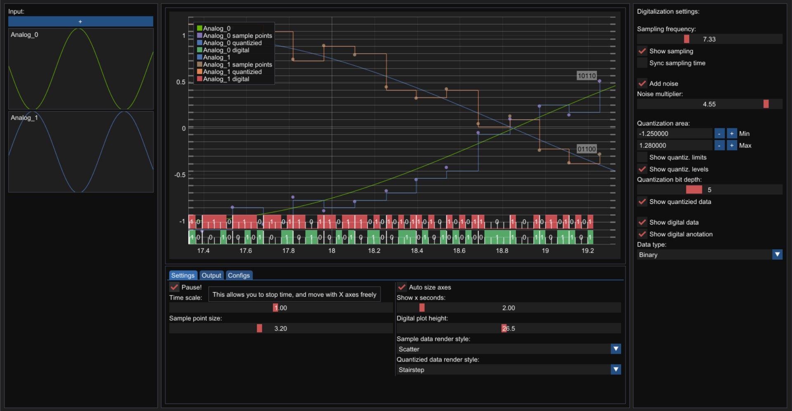

# Signal Digitization thesis
This is part of my thesis on demonstration of analog signal digitization.   
Supports Web Assembly & Windows builds.  
[Live demo](https://jacckii.github.io/SignalDigitization/)

[](https://jacckii.github.io/SignalDigitization/)

Windows version dependencies:
 - DirectX 10

Web assembly version dependencies:
 - browser with WASM support
 - browser with WebGL 2 support
 - browser with javascript support 

Libraries used:
 - Dear ImGui - https://github.com/ocornut/imgui
 - ImPlot - https://github.com/epezent/implot
 - ImGuiFileDialog - https://github.com/aiekick/ImGuiFileDialog
 - MagicEnum - https://github.com/Neargye/magic_enum
 - exprtk - https://github.com/ArashPartow/exprtk
 - nlohmann::json - https://github.com/nlohmann/json
 - Emscripten - https://github.com/emscripten-core/emscripten

ImGui and ImPlot libraries were slightly modified for this application.  
Please be aware that if you include any other version of these libraries, this app won't work the same!

Features:
 - Add multiple sources of "analog" signal
 - Input mathematic expression as input source
 - Render plots with real time generated data
 - Show sampling step of digitization
 - Show quantization step of digitization
 - Show digital data in main plot
 - Show digital data as string
 - export digital data into .csv file
 - Change value format for digital data output
 - Realistic noise generator
 - Extra gaussian noise for sampled data
 - Sync sampled timing
 - Show qunatization levels
 - Show quantization limits
 - Quantization bit prcession
 - GUI & plot customizations
 - Github workflows action script that builds and deploys code

## How to build:

### Windows .exe:
This version will output .exe application for x64 platforms
 - Build working under platform toolkit: v142
 - SDK: Windows SDK 10.0.22000.0

You will need Windows DirectX 10 SDK

```
git clone https://github.com/Jacckii/SignalDigitization
```
open signal_digitalization.sln in Visual studio 2019 and newver  
Build GUI library first!  
Then build the App application.  
Output should be in `\signal_digitalization\x64\Release\App.exe`


### Web assembly:
This will compile an Web assembly that can be run in browser platform independent, but these install steps are made for windows!
It should be possible to compile it on other platforms as well. For that see the documentation of Emscripten and Ninja

Install Emscripten and follow install instruction from DOCs: https://emscripten.org/docs/getting_started/downloads.html  
Make sure Emscripten is in your `%PATH%`  

Install Ninja https://ninja-build.org/  
you can download pre-built Ninja https://github.com/ninja-build/ninja/releases/  
then put your Ninja.exe into `C:\Ninja\` or somewhere else, and add that path to `%PATH%`  

If you're running Windows you can run
```
build.bat
``` 

the output will go in folder `web/build`

Alternatively, you can follow these steps to do it manually:

```
mkdir web
cd web
emcmake cmake ..
ninja -j4
```
This will output 2 files 
`index.js` and `index.wasm`  

Now, all you need is to copy those 2 files and `index.html` that can be found in the root directory of this repo to some web server with Apache or Nginx.

### Web assembly using GitHub workflow actions and GitHub pages:
All you need is to:
1. Fork this repo
2. run the Build and deploy action pre-configured in this repo
3. Configure GitHub Pages if they're not pre-configured already, or copy output of the gh-pages branch and upload it on Apache or Nginx server.
